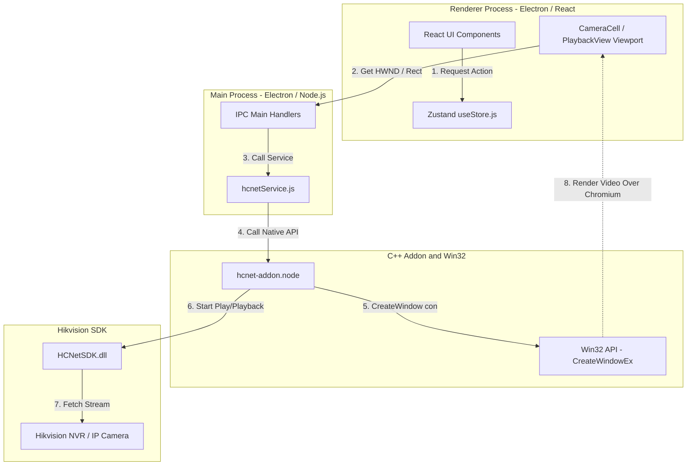
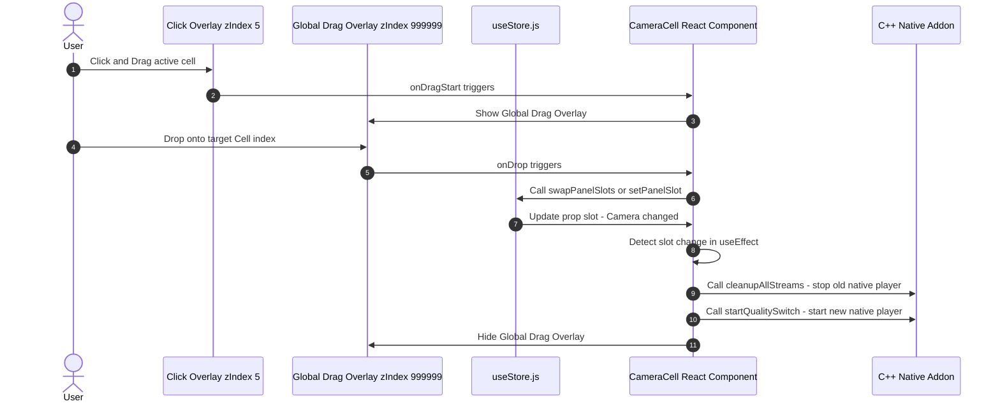
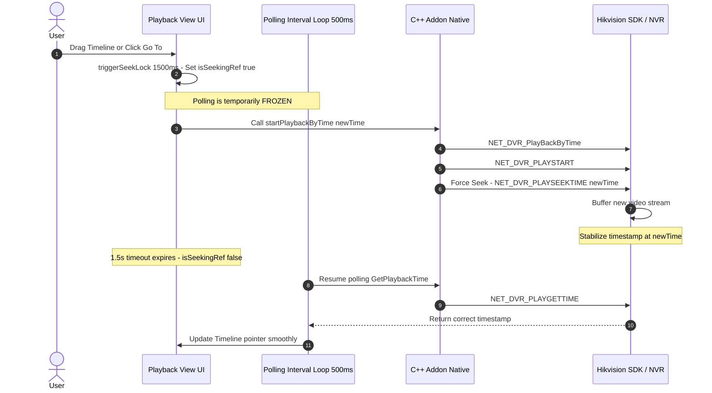
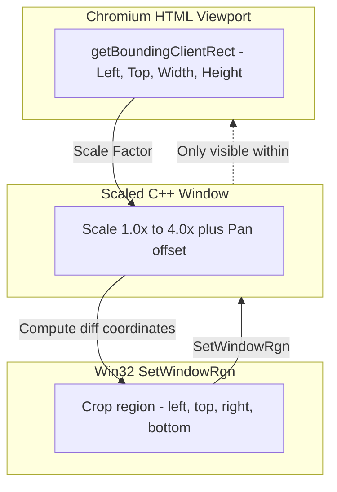

# 📊 Chi Tiết Tính Năng & Sơ Đồ Kiến Trúc Hệ Thống (vLAN-CameraHIK)

Tài liệu này cung cấp mô tả kỹ thuật chi tiết của các tính năng cốt lõi và các sơ đồ kiến trúc (sử dụng Mermaid.js) để trực quan hóa luồng hoạt động của dự án.

---

## 1. Sơ Đồ Kiến Trúc Tổng Thể Dự Án (System Architecture)

Dự án tuân theo kiến trúc đa tiến trình (Multi-Process) của Electron, kết nối chặt chẽ giữa giao diện React (Chromium DOM) và bộ nhân điều khiển C++ Addon (Win32 / SDK).

### Cách thức hoạt động:
1. **React UI** tính toán kích thước ô grid và gửi sự kiện kèm toạ độ tương đối của viewport lên **IPC Main**.
2. **Main Process** xác định cửa sổ cha (`HWND` của Chromium), chuyển tiếp toạ độ thật (đã nhân scale factor DPI) xuống **C++ Addon**.
3. **C++ Addon** gọi Win32 API tạo cửa sổ con (`CreateWindowEx` với cờ `WS_CHILD | WS_VISIBLE | WS_CLIPSIBLINGS`) neo trực tiếp vào cửa sổ cha.
4. Addon truyền handle của cửa sổ con này sang **Hikvision SDK** làm cổng vẽ để SDK giải mã và xuất luồng hình ảnh trực tiếp lên đó.

---

## 2. Tính Năng LiveView & Kéo Thả Hoán Đổi (Drag & Drop Swap)

Nhờ lớp phủ click trong suốt (Click Overlay, `zIndex: 5`) nhận diện sự kiện kéo thả và lớp phủ kéo thả toàn cục (Global Drag Overlay, `zIndex: 999999`) bảo vệ sự kiện của Chromium khỏi bị cửa sổ video native nuốt chửng.

### Chi tiết luồng xử lý:
- **Kéo:** Click Overlay nhận cú click-drag, Chromium kích hoạt `onDragStart`, lưu trữ thông tin ô nguồn và hiển thị khung viền màu cam đứt đoạn trên mọi ô grid để mời gọi thả.
- **Thả:** Khi thả vào ô đích, `onDrop` kích hoạt, cập nhật store.
- **Phát đè / Hoán đổi:** `CameraCell` phát hiện camera ID đã thay đổi. Nó lập tức gọi hàm dọn dẹp `cleanupAllStreams()` để tắt luồng cũ giải phóng handle, sau đó gọi `startQualitySwitch()` để nạp luồng mới lên cửa sổ native sạch sẽ.

---

## 3. Tính Năng Playback Pro: Seek Lock & Cưỡng Bức Seek (Force Seek)

Cơ chế chống giật ngược timeline về đầu ngày do độ trễ buffer của đầu ghi NVR.

### Chi tiết luồng xử lý:
- **Seek Lock:** Khi có lệnh tua (Seek), ứng dụng tạm thời khoá biến `isSeekingRef = true` trong 1.5 giây. Trong thời gian này, vòng lặp polling 500ms lấy thời gian từ SDK bị vô hiệu hoá. Điều này ngăn việc SDK trả về mốc thời gian cũ/rỗng khi đang buffer kéo giật ngược timeline về đầu ngày.
- **Cưỡng bức Seek:** Trong C++ addon, ngay sau khi gọi `NET_DVR_PLAYSTART`, hệ thống thực hiện một lệnh seek cưỡng bức (`NET_DVR_PLAYSEEKTIME`, lệnh số `11`) tới mốc thời gian mong muốn. Lệnh này giải quyết lỗi một số NVR bỏ qua tham số `startTime` của hàm start và tự động phát từ đầu ngày.

---

## 4. Thu Phóng Kỹ Thuật Số (Electronic Zoom) & Giới Hạn Vùng Vẽ (Window Clipping)

Ngăn chặn cửa sổ video con native tràn viền che khuất Sidebar hoặc Timeline của Chromium khi người dùng phóng to video.

### Chi tiết luồng xử lý:
1. **Scale:** Khi người dùng cuộn chuột phóng to (1x - 4x), kích thước thực tế của cửa sổ native được nhân lên tương ứng.
2. **Pan:** Khi người dùng kéo rê chuột, toạ độ góc trái của cửa sổ con dịch chuyển theo offset di chuột.
3. **Clip (Cắt tỉa):** Toạ độ vùng giao nhau giữa viewport HTML và cửa sổ phóng to được tính toán. Win32 API `SetWindowRgn` được gọi để tạo một vùng cắt (`CreateRectRgn`) gán lên cửa sổ native. Toàn bộ phần video nằm ngoài viền viewport HTML sẽ bị hệ điều hành cắt tỉa hoàn toàn, đảm bảo giao diện luôn gọn gàng và không đè lên các thành phần Chromium khác.
