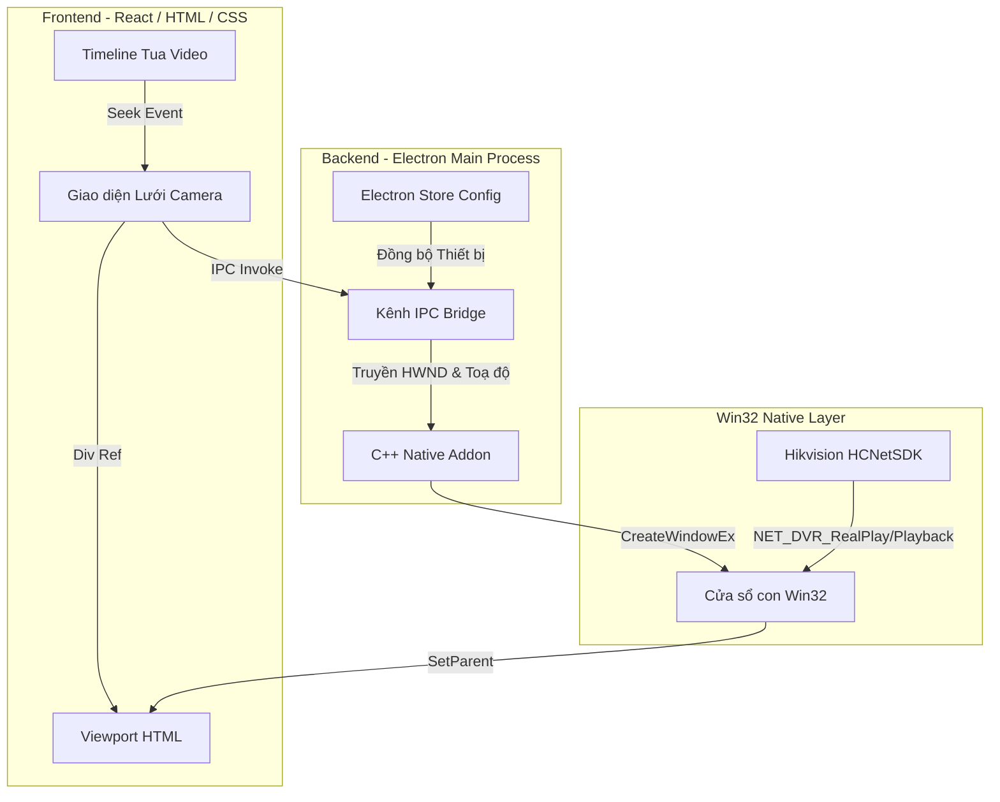

# 🖥️ vLAN-CameraHIK — Trình Giám Sát Camera & NVR Hikvision Chuyên Nghiệp

[](https://opensource.org/licenses/MIT)
[](#)
[](#)

**vLAN-CameraHIK** là ứng dụng giám sát video thời gian thực và xem lại (Playback) chuyên dụng cho các thiết bị Camera/NVR Hikvision. 

Ứng dụng kết hợp sức mạnh của **Vite + React** ở Frontend, **Electron** ở Backend điều phối và **Native C++ Addon (Node-API)** để kết nối trực tiếp với SDK gốc (`HCNetSDK.dll`) của Hikvision. Điều này mang lại hiệu năng vẽ video native phần cứng cực kỳ mượt mà, độ trễ tối thiểu và khả năng tương tác vượt trội so với các giải pháp RTSP Web thông thường.

---

## 🗺️ Sơ đồ Kiến trúc Hệ thống

Dưới đây là mô hình luồng dữ liệu và cơ chế vẽ video bằng **Win32 Parent-Child Window Binding** giúp lồng cửa sổ video native của SDK vào giao diện HTML của Chromium:



---

## 🚀 Các Tính Năng Nổi Bật

### 1. Giám Sát Thời Gian Thực (LiveView Grid)
*   **Lưới hiển thị động đa dạng:** Hỗ trợ cấu hình lưới linh hoạt từ 1×1, 2×2, 3×3, 4×4 đến **5×5 (tổng cộng 25 ô camera)** cùng lúc.
*   **Phóng to/Thu nhỏ (Fullscreen) mượt mà:** Nhấp đúp chuột vào bất kỳ ô camera nào để phóng to toàn màn hình thông qua cơ chế chuyển đổi lớp CSS Grid động, không gây giật lag.
*   **Kéo thả hoán đổi ô (Drag & Drop Swap):** Kéo thả trực tiếp camera từ danh sách thiết bị Sidebar vào lưới phát, hoặc kéo hoán đổi vị trí (swap) các ô camera đang phát trên lưới.
*   **Điều khiển PTZ chuyên nghiệp:** Hỗ trợ quay quét 8 hướng, điều chỉnh Zoom quang học và Focus của camera trực tiếp từ Drawer điều khiển.

### 2. Xem Lại & Tua Video Cao Cấp (Playback Pro)
*   **Phát nhanh một nhấp:** Chọn ngày trên lịch và camera, hệ thống sẽ tự động tìm kiếm và phát luồng video bắt đầu từ thời điểm bạn đang xem hoặc đầu ngày ngay lập tức.
*   **Trục thời gian (Timeline) thông minh:**
    *   Kéo chuột trái trên timeline để tua video thời gian thực (tích hợp cơ chế throttle 150ms để tối ưu hóa hiệu năng gọi lệnh SDK).
    *   Giữ phím `Shift` + kéo rê chuột để di chuyển (Pan) trục thời gian timeline.
    *   Cuộn chuột để phóng to/thu nhỏ (Zoom) timeline (từ thang chia 24 giờ chi tiết xuống thang 2 giờ).
*   **Khóa tua video (Seek Lock):** Đóng băng đồng bộ thời gian từ SDK lên UI trong 1.5 giây sau mỗi hành động tua/restart giúp tránh lỗi kẹt hoặc giật ngược thời gian về đầu ngày của đầu ghi NVR.
*   **Đồng bộ Ngày Lịch & Giờ:** Ô nhập thời gian tải mặc định luôn tự động cập nhật đồng bộ theo đúng ngày được chọn trên lịch và mốc thời gian bạn đang xem trên video (`currentTime`), tránh lỗi tải video trống.

### 3. Cửa Sổ Giám Sát Phụ Siêu Nhẹ (Popout Panel Pro)
*   **Không giới hạn màn hình giám sát:** Cho phép người dùng tách lưới camera hiện tại ra thành các cửa sổ phụ độc lập (Popout Windows) để giám sát đa màn hình.
*   **Khả năng mở hàng chục cửa sổ song song:** Đây là ưu thế tuyệt đối mà ngay cả phần mềm iVMS-4200 gốc của Hikvision cũng không hỗ trợ. Cơ chế chạy cửa sổ con độc lập tiêu thụ tài nguyên cực kỳ ít (siêu nhẹ), hoạt động vô cùng trơn tru kể cả khi mở hàng chục popup liveview cùng lúc.

### 4. Thu Phóng Số (Electronic Zoom) & Clipping Region
*   **Phóng to vùng chi tiết:** Kích hoạt chế độ kính lúp, cuộn chuột để thu phóng kỹ thuật số từ 1.0x đến 4.0x và giữ chuột trái kéo rê để di chuyển vùng quan sát.
*   **SetWindowRgn (Win32):** Sử dụng cơ chế cắt tỉa vùng vẽ của cửa sổ native C++ khớp 100% với khung HTML. Video khi phóng to sẽ **không bao giờ vẽ đè** lên thanh Sidebar, Header hay Timeline của phần mềm.

### 5. Tải Video Tùy Chỉnh (NVR Download Clip)
*   **Bộ chọn Ngày Giờ Datetime-Local:** Cho phép người dùng chọn và chỉnh sửa trực quan cả ngày/tháng/năm và giờ/phút/giây trước khi tải xuống.
*   **Cơ chế Tải Video an toàn 100%:**
    *   **Trích xuất `playbackURI` gốc:** Tự động kết nối với API Search của NVR để trích xuất `playbackURI` thực tế chứa các tham số định danh lưu trữ vật lý (`name`, `size`).
    *   **Phương thức HTTP POST XML:** Sử dụng XML body có namespace và version schema đầy đủ gửi tới endpoint `/ISAPI/ContentMgmt/download`.
    *   **Cô lập Socket TCP (`Connection: close`):** Thiết lập header `Connection: close` buộc NVR đóng socket ngay sau khi tải xong, loại bỏ hoàn toàn lỗi lẫn lộn bộ đệm HTTP Keep-Alive trên đầu ghi Hikvision (lỗi báo `statusCode 6` / `two root tags`).

---

## 📊 So Sánh Tính Năng

| Tính năng | vLAN-CameraHIK (Ứng dụng này) | RTSP Web Player thông thường | iVMS-4200 (Hikvision gốc) |
| :--- | :---: | :---: | :---: |
| **Độ trễ vẽ hình (Latency)** | **Cực thấp (< 150ms)** | Cao (1 - 3 giây) | Thấp (< 150ms) |
| **Bật tách cửa sổ phụ (Popout)**| **Hỗ trợ hàng chục cửa sổ siêu nhẹ** | Không hỗ trợ | Không hỗ trợ (Chỉ mở 1 app duy nhất) |
| **Bố cục lưới camera** | Lên tới 25 ô (5x5) động | Hạn chế, giật lag | Tối đa 64 ô |
| **Cắt tỉa cửa sổ native** | Có (SetWindowRgn Win32) | Không (Bị vẽ đè lên HTML) | N/A (App native thuần) |
| **Tua video thời gian thực** | Mượt mà (có Seek Lock) | Trễ, không đồng bộ | Mượt mà |
| **Bảo mật cục bộ** | Mã hóa AES thông tin camera | Thường lưu text thuần | Lưu database cục bộ |
| **Đa ngôn ngữ** | Anh / Việt (i18n hook) | Thường chỉ có 1 ngôn ngữ | Nhiều ngôn ngữ |

---

## 📂 Cấu Trúc Thư Mục Dự Án

```text
├── electron/
│   ├── main.js                 # Luồng chính Electron, đăng ký các IPC handlers & giải mã cấu hình
│   ├── preload.js              # Cầu nối IPC bảo mật phơi bày api ra frontend
│   └── services/
│       └── hcnetService.js     # Quản lý khởi tạo/giải phóng SDK Hikvision
├── hcnet-addon/
│   ├── addon.cpp               # Module native C++ (Node-API) vẽ video, PTZ, capture, playback
│   └── CMakeLists.txt          # Cấu hình build native C++ bằng cmake-js
├── src/
│   ├── components/
│   │   ├── CameraCell.jsx      # Quản lý ô phát video LiveView, điều khiển PTZ, Drag-Drop
│   │   ├── PlaybackView.jsx    # Màn hình Playback, điều khiển tua video, zoom số, download modal
│   │   ├── PlaybackTimeline.jsx# Trục thời gian tua video dạng thước đo thông minh
│   │   ├── PlaybackCalendar.jsx# Bộ chọn ngày ghi hình dạng lịch tháng kết nối API search
│   │   └── Sidebar.jsx         # Danh sách camera, quản lý panel lưới
│   ├── pages/
│   │   ├── LiveView.jsx        # Lưới camera LiveView chính
│   │   ├── Playback.jsx        # Trang phát xem lại video
│   │   └── Settings.jsx        # Quản lý cấu hình, độ phân giải luồng, ngôn ngữ (Anh/Việt)
│   ├── i18n/
│   │   ├── en.js               # Từ điển ngôn ngữ tiếng Anh
│   │   ├── vi.js               # Từ điển ngôn ngữ tiếng Việt
│   │   └── useLanguage.js      # React hook quản lý đa ngôn ngữ
│   └── store/
│       └── useStore.js         # Quản lý trạng thái toàn cục (Zustand store)
├── package.json                # Định nghĩa các script biên dịch, rebuild native & package
└── README.md                   # Tài liệu giới thiệu dự án
```

---

## 🛠️ Hướng Dẫn Cài Đặt Mới & Biên Dịch

Xem tài liệu hướng dẫn chi tiết từng bước cho người dùng và nhà phát triển tại:
👉 **[Hướng dẫn cài đặt chi tiết (INSTALLATION_GUIDE.md)](file:///f:/ivms/INSTALLATION_GUIDE.md)**

---

## 📜 Bản Quyền & Giấy Phép

Dự án được phân phối dưới giấy phép **MIT License**. Bạn được tự do sử dụng, chỉnh sửa và phân phối lại cho mục đích thương mại hoặc cá nhân. Xem chi tiết tại tệp tin [LICENSE](file:///f:/ivms/LICENSE).
