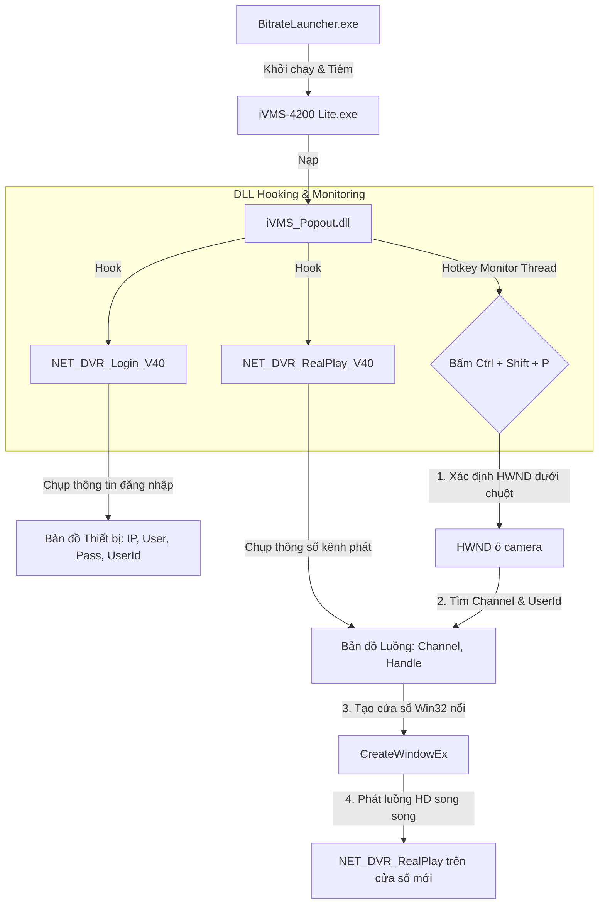

# 🖥️ vLAN-CameraHIK Version 2 — iVMS-4200 Lite Popout Patch

**vLAN-CameraHIK Version 2** là giải pháp bản vá mở rộng (Patch) dành riêng cho phần mềm **iVMS-4200 Lite chính gốc** của Hikvision. 

Bản vá này sử dụng kỹ thuật **API Hooking** và **DLL Injection** để tích hợp tính năng **Popout Panel (Tách cửa sổ nổi độc lập)** trực tiếp vào phần mềm iVMS-4200 Lite. Nhờ đó, người dùng vừa được thừa hưởng 100% sự ổn định, khả năng giải mã phần cứng GPU mượt mà của phần mềm chính hãng, vừa sở hữu tính năng tách camera thành các cửa sổ nổi tự do để giám sát đa màn hình.

---

## 🗺️ Sơ đồ Kiến trúc Hoạt động



---

## 🚀 Tính Năng Chính

*   **Tách cửa sổ nổi (Popout Window) không giới hạn:** Nhấp phím tắt trên bất kỳ ô camera nào đang phát để tách nó thành một cửa sổ Windows độc lập. Cửa sổ này có đầy đủ thanh tiêu đề, cho phép di chuyển sang màn hình phụ, co giãn tự do.
*   **Phát luồng HD chất lượng cao:** Luồng popout sẽ tự động kết nối và giải mã ở chất lượng HD căng nét nhất mà không phụ thuộc vào giới hạn bitrate của lưới phát chính.
*   **Ổn định tuyệt đối:** Bản vá chạy độc lập, không can thiệp thay đổi cấu trúc cây cửa sổ gốc của iVMS-4200 Lite nên tuyệt đối không gây crash hay lủng lỗ màn hình.
*   **Không tốn tài nguyên:** Bản vá là một thư viện DLL C++ native siêu nhẹ (chỉ khoảng vài chục KB) chạy ngầm, không gây hao phí tài nguyên CPU/RAM của hệ thống.

---

## 🎹 Hướng Dẫn Sử Dụng Phím Nóng (Hotkey)

1.  Mở phần mềm iVMS-4200 Lite thông qua phím tắt của **`BitrateLauncher.exe`** (để tự động tiêm bản vá vào ứng dụng).
2.  Mở các camera phát trên lưới bình thường.
3.  **Cách Popout:**
    *   Di con trỏ chuột vào vị trí ô camera mà bạn muốn tách ra cửa sổ nổi.
    *   Nhấn tổ hợp phím: **`Ctrl + Shift + P`**
    *   Một cửa sổ nổi chứa camera đó sẽ lập tức xuất hiện! Bạn có thể kéo cửa sổ này sang bất kỳ màn hình nào khác.
4.  **Cách đóng Popout:** Click nút **`✕` (Close)** trên thanh tiêu đề của cửa sổ nổi để đóng camera và giải phóng tài nguyên.

---

## 🛠️ Hướng Dẫn Biên Dịch (Compile)

### 1. Chuẩn bị công cụ:
*   Đã cài đặt **Visual Studio 2019/2022** (có phần phát triển C++ Desktop).
*   Đã cài đặt **CMake** (phiên bản 3.10 trở lên).

### 2. Các bước biên dịch:
Mở PowerShell tại thư mục `/ver2/popout-patch` và chạy các lệnh sau:

```powershell
# Tạo thư mục build
mkdir build
cd build

# Cấu hình dự án bằng CMake
cmake ..

# Biên dịch release
cmake --build . --config Release
```

Sau khi hoàn tất, các file sản phẩm sẽ được tạo ra tại thư mục `build/bin/Release`:
*   `iVMS_Popout.dll` (Bản vá DLL)
*   `BitrateLauncher.exe` (Launcher điều phối)

---

## 📦 Cách Cài Đặt

1.  Copy cả 2 file `iVMS_Popout.dll` và `BitrateLauncher.exe` vào **thư mục cài đặt gốc** của phần mềm iVMS-4200 Lite:
    *   Đường dẫn mặc định: `C:\Program Files\iVMS-4200 Site\iVMS-4200 Portal\` hoặc `C:\Program Files (x86)\iVMS-4200 Site\iVMS-4200 Portal\`
2.  Tạo phím tắt (Shortcut) cho `BitrateLauncher.exe` ra màn hình Desktop.
3.  Từ nay, hãy chạy iVMS-4200 Lite thông qua shortcut của `BitrateLauncher.exe` để kích hoạt tính năng Popout Panel!
